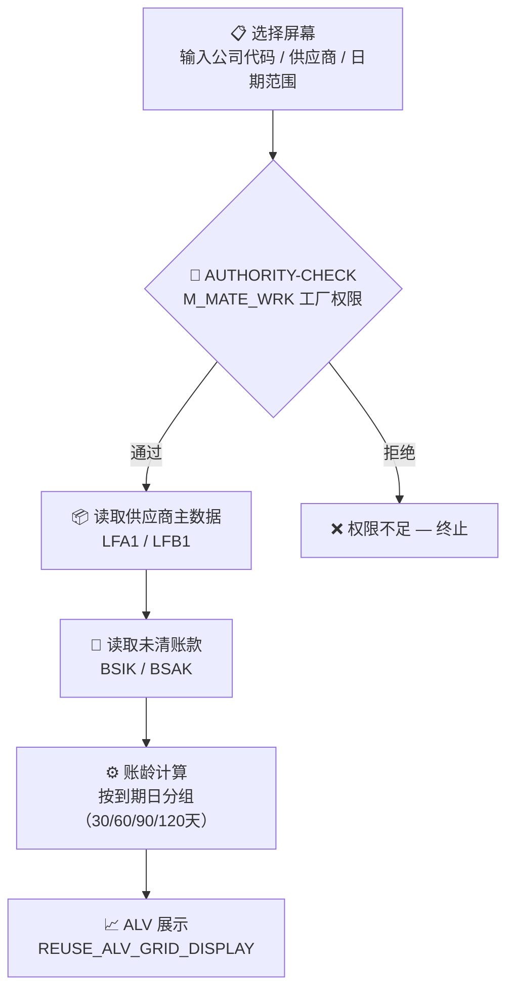

# abap2ts — 使用手册

> **面向最终用户的操作指南**
> 本手册介绍如何使用 `/abap2ts` Skill，从 SAP 系统自动生成技术规格说明书（Technical Specification）。

---

## 目录

1. [快速开始](#1-快速开始)
2. [完整流程说明](#2-完整流程说明)
3. [各对象类型操作示例](#3-各对象类型操作示例)
4. [输出文件说明](#4-输出文件说明)
5. [多对象处理](#5-多对象处理)
6. [自定义文档模板](#6-自定义文档模板)
7. [常见问题](#7-常见问题)

---

## 1. 快速开始

确保已完成安装配置（见 [REQUIREMENTS.md](REQUIREMENTS.md)），然后在 Claude Code 中输入：

```
/abap2ts
```

AI 会自动引导你完成全部步骤，**无需任何手动编码**，最终在 `output/` 目录生成 Word 文档和流程图文件。

---

## 2. 完整流程说明

### 第一步：回答 4 个初始问题

触发 `/abap2ts` 后，AI 会一次性提出 4 个问题：

---

**问题 1 — 对象类型**

选择你要生成说明书的 ABAP 对象类型：

| 选项 | 适用场景 |
|------|---------|
| 自开发 ABAP 程序 | SE38 中的 Report / Module Pool（程序名以 Z 或 Y 开头）|
| BAdI / 系统增强 | SE19 的 BAdI 实现，或隐式增强、User-Exit |
| Function Module | SE37 中的函数模块 |
| ABAP Class / Interface | SE24 中的类（ZCL_*）或接口（ZIF_*）|
| Other（自行输入）| CDS View、RAP BDEF、数据字典表结构等 |

---

**问题 2 — 对象名称**

直接在 **Other 输入框**中填写对象名称（区分大小写）：

```
示例：ZFIN_AP_INVOICE_REPORT
      ZCL_FIN_INVOICE_PROCESSOR
      Z_FIN_GET_VENDOR_BALANCE
```

> 若不确定名称，选"不确定确切名称"，AI 会使用搜索功能协助定位。

---

**问题 3 — 文档语言**

- **中文（默认）**：章节标题、表头、注解均为中文
- **English**：全英文输出，适合国际化项目

---

**问题 4 — 输出模板**

- **标准模板（推荐）**：固定四章结构（见[第 4 节](#4-输出文件说明)）
- **自定义模板**：提供自己的章节结构，AI 按你的格式生成（见[第 6 节](#6-自定义文档模板)）

---

### 第二步：AI 自动读取 SAP 对象

回答完问题后，AI 会：

1. 连接 SAP 系统，读取主对象源码、参数签名、字段定义
2. 自动识别并读取依赖的自定义对象（Z*/Y* 开头，最多 2 层）
3. 对关键代码段添加 `* [注]` 业务逻辑注解
4. 生成业务流程 Mermaid 图（选择屏幕 → 权限校验 → 数据读取 → 处理 → 输出）

> 此步骤通常需要 30 秒～3 分钟，取决于对象复杂度和 SAP 系统响应速度。

---

### 第三步：接收生成结果

AI 完成后输出：

```
Technical Specification 生成完成！

📄 文件路径：./output/ZFIN_AP_INVOICE_REPORT_TS.docx
📊 流程图：  ./output/ZFIN_AP_INVOICE_REPORT_FLOW.md

文档包含：
  ✓ 第一章  开发背景及目的
  ✓ 第二章  开发对象清单（3 个对象）
  ✓ 第三章  核心逻辑流程（Mermaid 流程图）
  ✓ 第四章  关键代码解析（12 个方法 / 带注解源码）
```

---

## 3. 各对象类型操作示例

### 3.1 ABAP 程序（Report）

**适用**：SE38 中以 Z/Y 开头的报表程序

**输入示例**：
- 对象类型：自开发 ABAP 程序
- 对象名称：`ZFIN_VENDOR_AGING_REPORT`

**AI 读取内容**：
- 主程序源码（含 INITIALIZATION、START-OF-SELECTION 等事件块）
- 所有 INCLUDE 子程序文件
- FORM/ENDFORM 业务逻辑段

---

### 3.2 ABAP 类（Class）

**适用**：SE24 中以 ZCL_ 开头的类

**输入示例**：
- 对象类型：ABAP Class / Interface
- 对象名称：`ZCL_FIN_INVOICE_PROCESSOR`

**AI 读取内容**：
- 类定义（PUBLIC / PROTECTED / PRIVATE SECTION）
- 所有方法实现
- 实现的接口（ZIF_*）

---

### 3.3 函数模块（Function Module）

**适用**：SE37 中以 Z/Y 开头的函数模块

**输入示例**：
- 对象类型：Function Module
- 对象名称：`Z_FIN_GET_VENDOR_BALANCE`

> AI 会自动读取该函数模块所属的函数组（Function Group）。

---

### 3.4 BAdI / 系统增强

**适用**：SE19 中自定义的 BAdI 实现，或隐式增强点

**输入示例**：
- 对象类型：BAdI / 系统增强
- 对象名称：`ZFIN_MM_INVOICE_CHECK`（Enhancement Implementation 名称）

**AI 读取内容**：
- Enhancement Implementation 源码
- 对应的 Enhancement Spot 定义
- 实现类的方法

---

### 3.5 CDS View / RAP BDEF（Other 类型）

**输入示例**：
- 对象类型：Other（在 Other 输入框填写 `CDS View`）
- 对象名称：`ZI_FIN_INVOICE`

AI 会根据名称自动判断并调用 `GetView` 或 `GetBehaviorDefinition`。

---

## 4. 输出文件说明

每次生成产出**两个文件**，存放在 `output/` 目录（默认）：

### 4.1 `<对象名>_TS.docx` — 技术规格说明书

Word 文档，包含四个章节：

| 章节 | 内容 | 说明 |
|------|------|------|
| **第一章** 开发背景及目的 | 业务背景、开发目的、适用范围 | AI 根据对象描述和代码注释推断 |
| **第二章** 开发对象清单 | 涉及的所有自定义对象表格 | 包含对象名、类型、功能描述 |
| **第三章** 核心逻辑流程 | 依赖关系表 + **Mermaid 流程图 PNG** | 展示业务执行脉络（非对象依赖图）|
| **第四章** 关键代码解析 | 参数说明表 + 带注解的 ABAP 源码 | `* [注]` 行以绿色斜体显示 |

**第四章代码注解示例**：

```abap
* ══════════════════════════════════════════════════
* 【FORM GET_VENDOR_DATA】读取供应商主数据及银行信息
* ══════════════════════════════════════════════════
FORM get_vendor_data.

* [注] 按公司代码和供应商号读取未清账款，排除已冲销凭证，用于账龄计算基础数据
  SELECT bukrs lifnr augdt bldat wrbtr
    FROM bsik
    INTO TABLE gt_bsik
    WHERE bukrs IN s_bukrs
      AND lifnr IN s_lifnr.

* [注] SY-SUBRC 非零表示无未清账款，直接退出避免后续空表处理
  IF sy-subrc <> 0.
    MESSAGE 'No open items found' TYPE 'I'.
    RETURN.
  ENDIF.

ENDFORM.
```

---

### 4.2 `<对象名>_FLOW.md` — 流程图 Markdown

包含 Mermaid 代码块，可在以下工具中直接渲染：

- **VS Code**：安装 Markdown Preview Mermaid Support 插件
- **GitHub / GitLab**：直接在仓库中预览
- **Typora**：原生支持
- **飞书/Notion**：粘贴代码块后选择 Mermaid 格式

```markdown
# ZFIN_VENDOR_AGING_REPORT — 业务流程


```

---

## 5. 多对象处理

如需一次生成多个对象的联合说明书：

1. 在"对象名称"问题中，选择"多个对象（逗号分隔）"提示，然后在 Other 中输入：
   ```
   ZFIN_AP_INVOICE,ZCL_FIN_PROCESSOR,ZIF_FIN_CONSTANTS
   ```

2. AI 会按顺序读取所有对象，统一注册到上下文后生成**一份包含所有对象的 TS 文档**。

3. 第二章"开发对象清单"会列出所有对象，第四章会分别展示每个对象的代码解析。

> **提示**：关联性强的对象（如一个程序 + 它调用的类）建议放在一起生成，AI 能更准确地描述对象间的协作关系。

---

## 6. 自定义文档模板

若公司有固定的 TS 文档格式，选择"自定义模板"后按提示提供章节结构：

**示例输入**：
```
1. 项目概述
2. 技术背景
3. 程序清单
4. 核心处理逻辑
5. 数据流说明
6. 代码详解
7. 测试要点
```

**AI 映射结果**：
```
✓ 章节 1 "项目概述"     → 开发背景及目的
✓ 章节 2 "技术背景"     → 开发背景及目的（合并）
✓ 章节 3 "程序清单"     → 开发对象清单
✓ 章节 4 "核心处理逻辑" → 核心逻辑流程
✓ 章节 5 "数据流说明"   → 核心逻辑流程（合并）
✓ 章节 6 "代码详解"     → 关键代码解析
✗ 章节 7 "测试要点"     → 暂不支持自动生成，已跳过
```

最终文档的章节标题将使用你提供的名称（如"核心处理逻辑"而非"核心逻辑流程"）。

---

## 7. 常见问题

### Q1：AI 读取 SAP 对象时报错"对象不存在"

**原因**：对象名称大小写或拼写有误，或该对象在所连接的 SAP 系统中不存在。

**解决**：
1. 在问题 2 中选"不确定确切名称"，AI 会搜索相似名称供你确认
2. 在 SAP 系统中用 SE38/SE24/SE37 确认对象名称后重新尝试

---

### Q2：第三章流程图显示的是对象依赖关系而非业务流程

**原因**：AI 未在 `metadata.mermaidFlow` 中填写业务流程图，回退到了自动生成的依赖图。

**解决**：这通常是上下文不足导致的。可以在对话中补充说明：
```
程序的主要业务流程是：选择屏幕输入参数 → 权限校验 → 
从 LFA1/BSIK 读取数据 → 账龄计算 → ALV 输出，
请重新生成流程图
```

---

### Q3：第四章"关键代码解析"内容很少或只有声明

**原因**：AI 可能只读取了变量声明区域，未获取业务逻辑代码段。

**解决**：在提示中明确说明：
```
请重新读取 FORM GET_VENDOR_DATA 和 FORM CALCULATE_AGING 的完整代码，
包含所有 SELECT、IF 分支和计算逻辑，并添加业务注解
```

---

### Q4：生成的文档中 SAP 系统信息被暴露

**原因**：AI 读取时可能将 SAP URL 或用户名写入文档。

**解决**：这是 BUG，请在 GitHub Issues 中报告。当前可在生成后手动检查并删除第一章中的系统连接信息。

---

### Q5：流程图 PNG 在 Word 中显示不全/被截断

**原因**：流程图节点过多，即使缩放后仍超出页面高度（系统限制最大 620pt 高度）。

**解决**：
- 让 AI 简化流程图，合并相似步骤，控制在 5～9 个节点内
- 或使用 `_FLOW.md` 文件在 Mermaid 渲染工具中查看完整图

---

### Q6：想修改已生成文档中的某个章节内容

生成的 `.docx` 是标准 Word 文档，可直接用 Microsoft Word 或 WPS Office 打开编辑。

如需 AI 重新生成某个章节，在对话中说明：
```
请重新生成第四章，这次包含 FORM CHECK_AUTHORITY 的完整代码
```

---

### Q7：如何更换输出目录

在 Phase 2 阶段，AI 会询问输出目录（默认 `./output`）。输入你想要的绝对或相对路径：
```
/Users/yourname/Desktop/TS文档
```

---

## 附录：输出文件命名规则

| 情况 | 文件名 |
|------|-------|
| 单个对象 | `<对象名>_TS.docx`，如 `ZFIN_AP_INVOICE_TS.docx` |
| 多个对象 | 以第一个对象命名，如 `ZFIN_AP_INVOICE_TS.docx` |
| 流程图 | 同前缀 + `_FLOW.md`，如 `ZFIN_AP_INVOICE_FLOW.md` |
